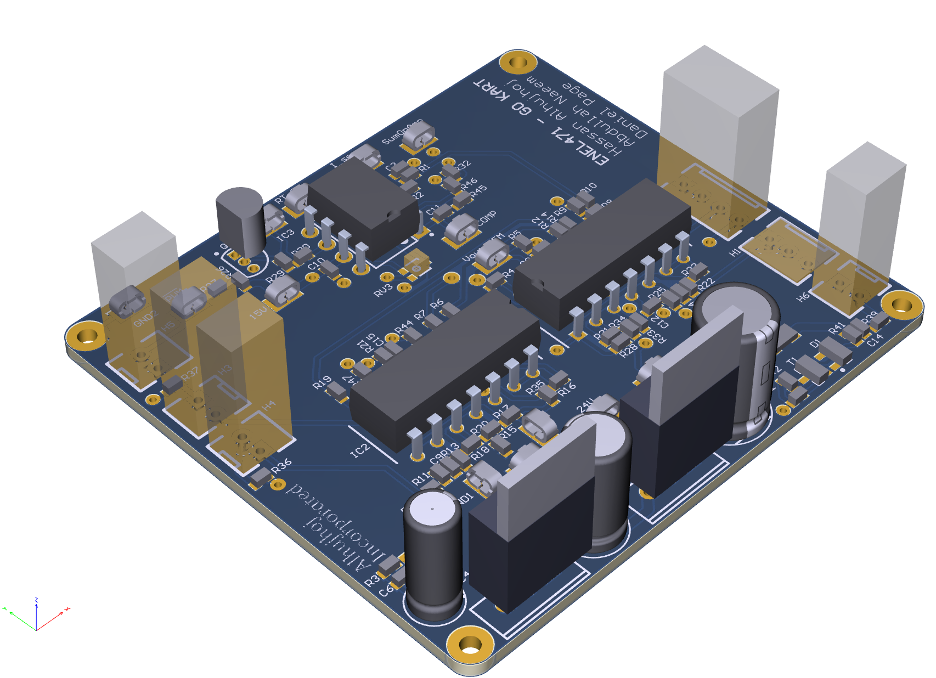

# ENEL471 - Go Kart Project

## Description
This project aims to design a control circuit that controls a current signal coming from Go-Kart circuitry.The controller board controls a Driver Board that is then interfaced a Power Circuitry Board that then powers a 3kW DC motor. The control board is based on the design of a fixed frequency current mode controller UC3843. This conroller board works by comparing throttle current (Idemand) with the motor current (Imeasured) that is read a current sensor (LEM HAIS 150P).

## Requirements
###  Design Constraints (essential for real life limitation for Go Kart electrical vehicles)
- Forwad motor current must not exceed 350A. The current-time area above 150A msut not be exceed for more than 100 Amp-seconds.
- Reverse motor current must not exeed 100A.
- Average forward motor currrent must not exceedd 150A.
- No MOSFET can be switched faster than 5kHz.
### Note: Violation of Deisgn Constraints will result in a 5-second shutdown.

## Important
- The PWM signal which the deiver uses to switch the MOSFETS.
- The shutdown control SD, which disables the MOSFET diver chip.
- The 24V DC supply from which all pwer supplies must be derived.
- The current sensor header connections.

## Goals
### Successfully Producing a PWM using UC3843 chip
* Voltage swing of 5V (referenced to GND).
* Rise and fall times < 1us.
* A PWM switching frequency of 2.5kHz+-10%.

### A PWM that is controllable via throttle
A normally open position switch has been installed on the brake pedal so that you can detect whenever the brake is operated. 
Your control system must be able to detect when the brake pedal has been depressed and immediately disable the drive circuitry. 
Reset this function by releasing the brake. When the Emergency Trip pushbutton switch is pressed it should disconnect all power 
to the motor and drive circuitry. When the switch is reset it should automatically re-enable the drive circuitry and put the 
cart in a safe ready-to-drive state. To earn full marks in this section your motor should not rotate when the throttle is not depressed.

### Implementation of a fixed current mode control
This requires you to sensibly use current feedback provided to you by the LEM sensor in your controller design. Your controller 
should be stable - your PWM should stay reasonably constant for a fixed throttle position and a fixed load. There should be no 
significant oscillations in any of the control signals.

### Throttle average current
Throttle sets average current and you limit aveage forward current to <150A, peak forward current to <350A and reverse current 
to <100A.Note: that you will only get full marks for this requirement if your controller actually attempts to push the average 
forward current >100A.

## Contributers
> - Hassan Alhujhoj
> - Abdullah Naeem 
> - Daniel Page
